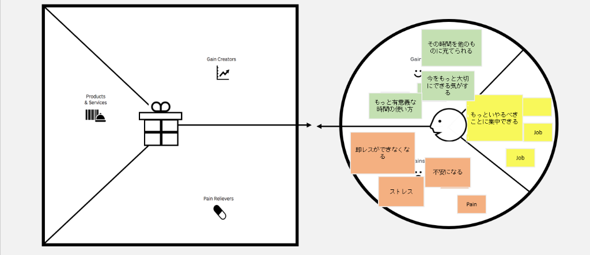

# VPC v1 - immaculate_eagle_60479

> 「**自分や周りの人を顧客に設定**」したVPC。13週後の自分が欲しいもの・身近な人のために作りたいものを設計する。
> v1 でいい。完璧を目指さない。第6回でアップデート(v2)します。

---

## 1. 解決したい困りごとを 1つ 選ぶ

> [`bug-list.md`](./bug-list.md) の20個から、**「自分が一番これを解決したい!」と思うもの** を1つ選んでください。
> 1つに絞れなければ、複数候補を書いてOK(後で絞り込みます)。

**選んだ困りごと**:

2. ドーパミン中毒でスマホをずっと見てしまう

---

## 2. その解決策のアイデアを書く

> 選んだ困りごとに対する「**こうだったらいいのに**」を1つ書く。
> 現実性は気にせず、自由に発想。

**解決のアイデア**:

スマホを物理的に制限するか、使用を抑制することで、本来やるべきことに集中できるようにする仕組み（プロダクト）

---

## 3. VPC本体

> 上で選んだ「困りごと」と「解決のアイデア」を起点に、6要素を埋めていきます。
> (画像から読み取った要素を元に構成しています。左側のバリューマップは空欄です)

### 🟦 Customer Profile(顧客=自分自身)

#### Jobs(やりたいこと・動詞で書く)

- もっとやるべきことに集中できる
- Job
- Job

#### Pains(困っていること)

- 即レスができなくなる
- 不安になる
- ストレス
- Pain

#### Gains(得たい未来・状態)

- その時間を他のものに充てられる
- 今をもっと大切にできる気がする
- もっと有意義な時間の使い方

---

### 🟧 Value Map(あなたが作るもの)

#### Products & Services

- [未記入]

#### Pain Relievers

- [未記入]

#### Gain Creators

- [未記入]

---

## 4. Fit確認(整合チェック)

| Pains/Gains | ↔ | Pain Relievers / Gain Creators | チェック |
|---|---|---|---|
| Pain ① | ↔ | Pain Reliever ① | ✗ |
| Pain ② | ↔ | Pain Reliever ② | ✗ |
| Pain ③ | ↔ | Pain Reliever ③ | ✗ |
| Gain ① | ↔ | Gain Creator ① | ✗ |
| Gain ② | ↔ | Gain Creator ② | ✗ |

> 整合しないものは「自分が作りたいだけ」のプロダクトになりがち。
> 迷ったら AI大学講師に壁打ち。

⠀
